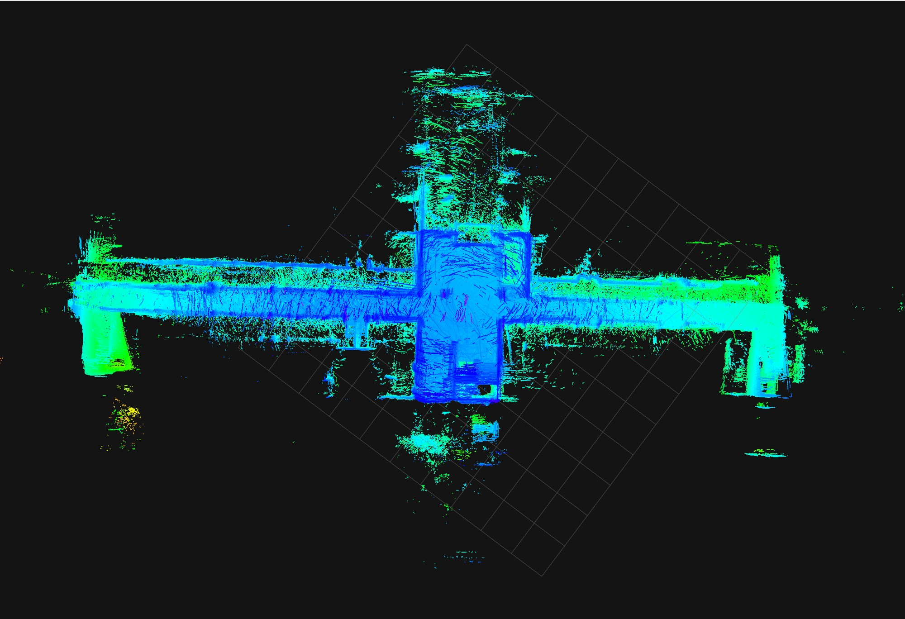
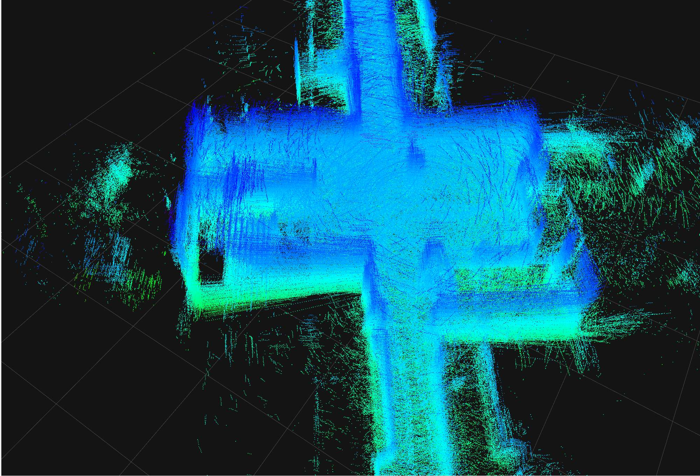
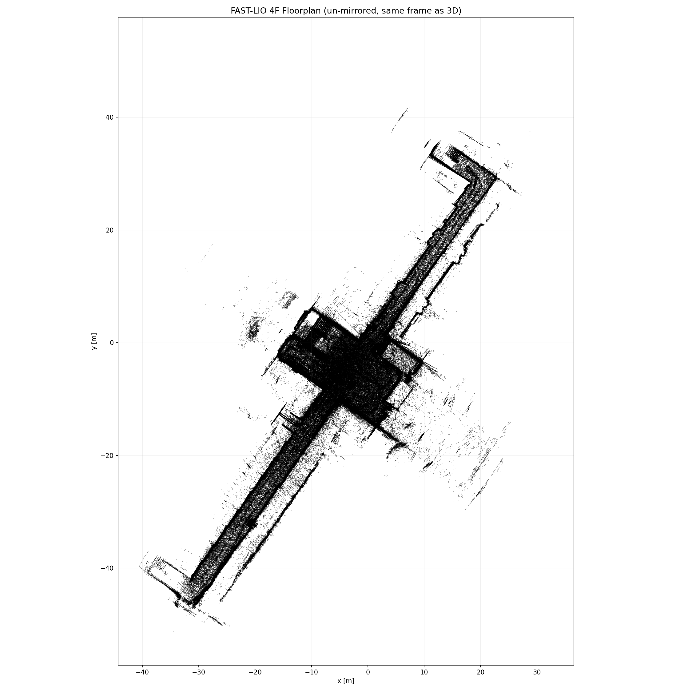
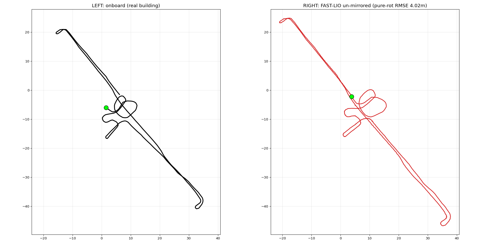
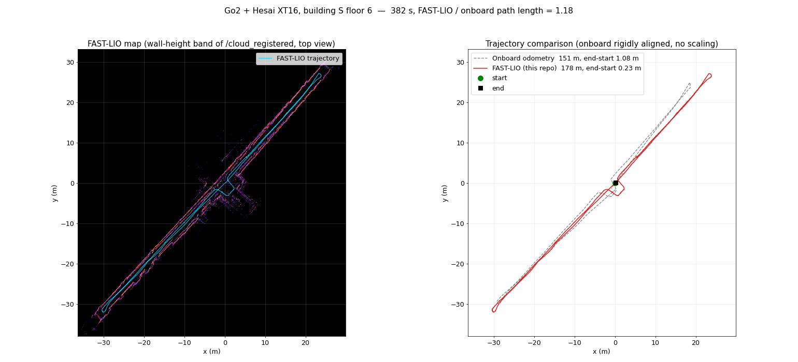

# Wjs-FAST_LIO

Unitree Go2(4족 로봇)에 Hesai XT16 라이다를 달고 실내를 걸으며 녹화한 rosbag에서 **FAST-LIO 오도메트리와 3D 지도**를 만드는 ROS 2 Humble 패키지입니다.

[Ericsii/FAST_LIO](https://github.com/Ericsii/FAST_LIO)(hku-mars FAST-LIO의 ROS 2 포트)에 다음을 더했습니다.
- Hesai 라이다 지원
- 보행 진동 대응
- 다리 속도와 자세 보정

추가 기능은 모두 환경변수로 켭니다. 끄면 원본 FAST-LIO와 똑같이 동작합니다.



## 결과

### 4층 복도 (402초 보행)



| 2D 평면도 | 온보드 odom(왼쪽) vs FAST-LIO(오른쪽) |
|---|---|
|  |  |

- **복도 길이:** FAST-LIO 93.5~94.7 m, 줄자 실측 94.6 m, 도면 93.75 m로 1% 안에서 맞습니다.
- **온보드와 차이:** FAST-LIO 경로가 Go2 온보드 odom보다 약 28% 깁니다. 온보드는 발 미끄러짐 때문에 이동 거리를 짧게 잽니다. 실측과 맞는 쪽은 FAST-LIO입니다.
- **만든 방식:** 이 레시피의 초기판으로 만들었습니다. 전처리, 다리 속도 융합, 진동 대응은 같고 설정 파일만 다릅니다.

### 6층 복도 (382초 보행, 이 저장소 설정 그대로)



- **FAST-LIO:** 178 m, 끝−시작 0.23 m
- **온보드 odom:** 151 m, 끝−시작 1.08 m (출발점으로 돌아오는 경로)
- **겹치는 방식:** 온보드 경로는 회전·이동만 맞췄고 크기는 바꾸지 않았습니다.

## 구성

```
Wjs-FAST_LIO/
├── src/
│   ├── fast_lio/              # 수정한 FAST-LIO (ROS 2 패키지, ikd-Tree 포함)
│   └── livox_ros_driver2/     # 빌드에 필요한 Livox 메시지 정의만
├── config/
│   ├── fastlio_go2_hesai_xt16.yaml   # Go2 + Hesai XT16 설정
│   └── qos_reliable.yaml             # bag 재생 QoS
├── scripts/
│   ├── make_ref_bag.py         # 1단계: IMU 정리
│   ├── add_leg_odom.py         # 2단계: 다리 속도 넣기
│   ├── run_fastlio.sh          # 3단계: 실행·녹화
│   └── export_odometry_csv.py  # 4단계: odom CSV (좌우 반전 되돌림)
├── tools/traj_compare_fig.py   # (선택) 지도·온보드 비교 그림
└── docs/                       # 변경 내역(CHANGES.md), 그림
```

## 요구 사항과 빌드

- Ubuntu 22.04, ROS 2 Humble
- 추가 패키지:
  ```bash
  sudo apt install ros-humble-pcl-ros ros-humble-pcl-conversions libpcl-dev libeigen3-dev python3-dev python3-numpy python3-matplotlib
  ```

```bash
git clone git@github.com:Wjs-SH/Wjs-FAST_LIO.git
cd Wjs-FAST_LIO
source /opt/ros/humble/setup.bash
colcon build --cmake-args -DCMAKE_BUILD_TYPE=Release
```

FAST-LIO는 빌드한 소스 위치(`src/fast_lio/Log/`)에 디버그 로그를 씁니다. 빌드한 뒤 폴더를 옮기면 다시 빌드하세요.

## 입력 bag 조건

| 토픽 | 형식 | 비고 |
|---|---|---|
| `/lidar_points` | `sensor_msgs/PointCloud2`, Hesai XT16 10 Hz | 점 필드 `x, y, z, intensity, timestamp(float64 절대 초), ring` |
| `/utlidar/imu` | `sensor_msgs/Imu` (Go2 내장 IMU) | 헤더 시계가 라이다와 달라도 됩니다. 1단계에서 맞춥니다 |
| `/tf` `odom → base_link` | Go2 온보드 odom | 2단계 다리 속도 계산에만 씁니다 |

- **시작할 때 로봇이 1.5초 이상 서 있어야 합니다.** 자이로 바이어스 추정과 FAST-LIO 초기화에 필요합니다. 걷는 도중부터 시작하면 발산합니다.
- 라이다 장착 위치(`extrinsic_T/R`)는 우리 로봇 기준입니다. 다른 로봇이면 설정 파일에서 바꾸세요.

## 사용법

```bash
source install/setup.bash

# 1. IMU 정리: IMU 시계를 라이다 시계로 맞추고, 200 Hz 균일화, 처음 1.5초 평균으로 자이로 바이어스 제거
python3 scripts/make_ref_bag.py bags/walk bags/walk_ref            # [구간초=0(전체)] [Hz=200] [바이어스초=1.5]

# 2. 온보드 /tf에서 몸체 속도를 계산해 /leg_odom으로 추가
python3 scripts/add_leg_odom.py bags/walk bags/walk_ref bags/walk_ref_leg

# 3. 130초만 먼저 돌려 확인한 뒤 전체 실행 (0.5배속 재생이라 실제 시간의 약 2배 걸림)
bash scripts/run_fastlio.sh bags/walk_ref_leg runs/walk_dry130 --duration 130
bash scripts/run_fastlio.sh bags/walk_ref_leg runs/walk_full

# 4. 경로를 CSV로 (좌우 반전을 되돌림: x := -x, yaw := -yaw)
python3 scripts/export_odometry_csv.py runs/walk_full runs/walk_full_odom.csv

# (선택) 지도 + 온보드 경로 비교 그림
python3 tools/traj_compare_fig.py bags/walk runs/walk_full runs/walk_full.png "my walk"
```

`run_fastlio.sh` 옵션은 `--duration`, `--rate`, `--config`, `--leg-gain`, `--attk`, `--z-gain`입니다. 결과 폴더가 이미 있으면 덮어쓰지 않고 멈춥니다.

## 결과가 괜찮은지 보는 법

1. **지도:** `/cloud_registered`를 위에서 봤을 때 벽이 한 줄이어야 합니다. 이중선이나 부채꼴이 보이면 실패입니다.
2. **프레임 간격:** `export_odometry_csv.py`가 알려주는 간격이 100 ms여야 합니다. 50 ms면 이전 실행의 `fastlio_mapping`이 남아 결과가 두 번씩 들어간 것입니다. `pgrep -x fastlio_mapping`으로 확인하고 끄세요.
3. **z 드리프트:** 한 방향으로 일정하게 쌓이는 z 드리프트는 이 레시피에서 흔합니다(예: 6층 382초에 +38.6 m). 평평한 한 층이면 `FASTLIO_GNDK=0.05`로 줄일 수 있습니다.

## 꼭 알아둘 점

- **출력은 좌우 반전입니다.** 이 설정에서 `/Odometry`와 `/cloud_registered`는 실제 건물과 x가 뒤집혀 나옵니다.
  - 실제 좌표로 쓰려면 `x := -x`, `yaw := -yaw`로 바꾸세요. `export_odometry_csv.py`가 기본으로 해 줍니다.
  - 온보드 odom과 회전·이동만으로 겹쳐 확인했습니다(6층 그림). 원인은 아직 확정하지 못했습니다.
- **설정의 `time_offset_lidar_to_imu: 0.0`은 1단계를 거친 bag 전용입니다.** 원본 bag에 쓰면 IMU와 스캔 시각이 어긋나 발산합니다.
- **재생은 reliable QoS, 0.5배속입니다.** FAST-LIO가 스캔을 버리지 않고 처리 속도에 맞춰 받게 하려는 것입니다.

## 환경변수

`run_fastlio.sh`의 기본값입니다. 0이면 해당 기능이 꺼지고 원본 FAST-LIO와 같습니다.

| 변수 | 기본값 | 역할 |
|---|---|---|
| `FASTLIO_SPK_KG`, `FASTLIO_SPK_KA`, `FASTLIO_SPK_ALPHA` | 100, 1, 0.9 | 보행 진동 순간에만 IMU 공분산을 키워 덜 믿음 |
| `FASTLIO_LEG_K` | 0.5 | `/leg_odom` 속도로 EKF 속도 크기를 보정 (전진 거리 드리프트 억제) |
| `FASTLIO_ATTK` | 0.05 | 자세를 중력 방향으로 조금씩 되돌림 (평지 가정) |
| `FASTLIO_GNDK` | 0 | z 위치를 시작 높이로 되돌림 (한 층, 평평한 바닥) |
| `FASTLIO_YAWK`, `FASTLIO_MANH_WARM` | 0, 150 | 벽 방향(90° 단위)에 yaw를 고정. 벽이 직교하는 긴 복도용 |
| `FASTLIO_MAXRANGE` | 0 | 이 거리(m)보다 먼 Hesai 점을 버림 |
| `FASTLIO_ZK` | 0 | z 속도 감쇠. 시험에서 효과가 없었음 |
| `FASTLIO_ODOMYAW` | 0 | `/leg_odom` 자세 yaw에 맞춤. 실험용이고 기본 레시피에서는 효과 없음 |

수식과 시험 결과는 [docs/CHANGES.md](docs/CHANGES.md)에 있습니다.

## 라이선스와 출처

- `src/fast_lio`
  - [hku-mars/FAST_LIO](https://github.com/hku-mars/FAST_LIO)를 [Ericsii/FAST_LIO](https://github.com/Ericsii/FAST_LIO) `ros2` 브랜치 `2fffc57`에서 가져와 수정했습니다.
  - **GPL-2.0**이고, 이 저장소의 수정분도 GPL-2.0입니다(`LICENSE`).
  - 원본 README의 그림 폴더(`doc/`)는 용량 때문에 뺐습니다.
- `src/fast_lio/include/ikd-Tree`: [hku-mars/ikd-Tree](https://github.com/hku-mars/ikd-Tree) `fast_lio` 브랜치 `e2e3f4e`. 원 저장소 라이선스를 따릅니다.
- `src/livox_ros_driver2`: [Livox-SDK/livox_ros_driver2](https://github.com/Livox-SDK/livox_ros_driver2)의 메시지 정의만 남긴 것이고, MIT 라이선스입니다(`LICENSE.txt`).
